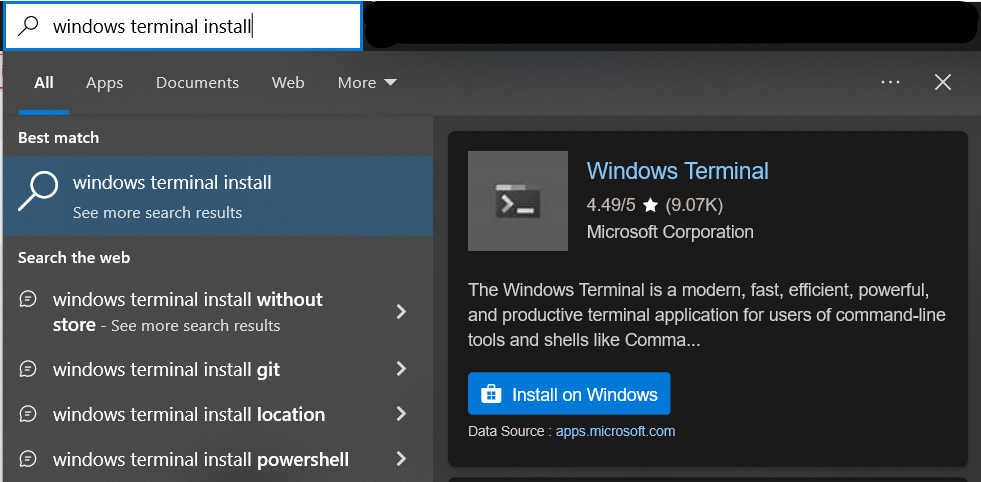
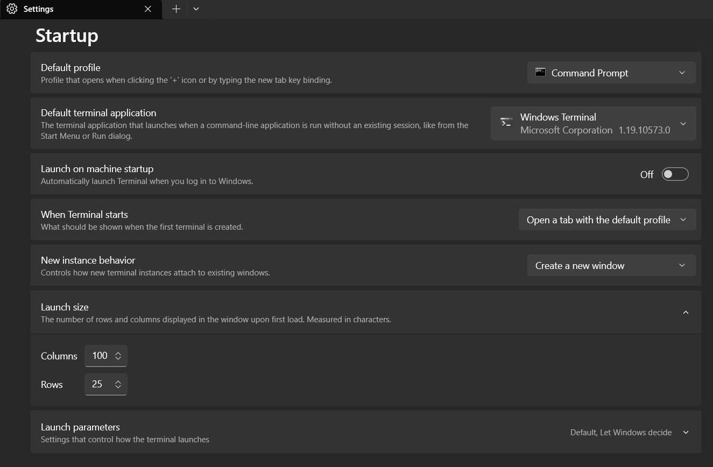
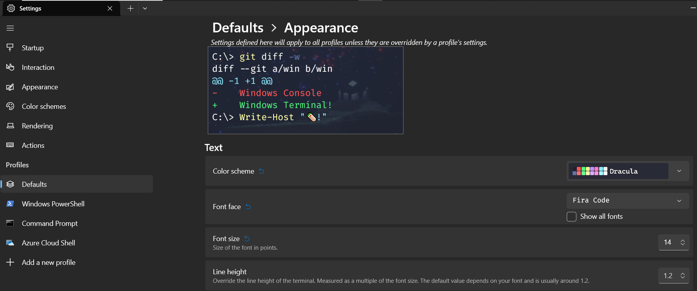
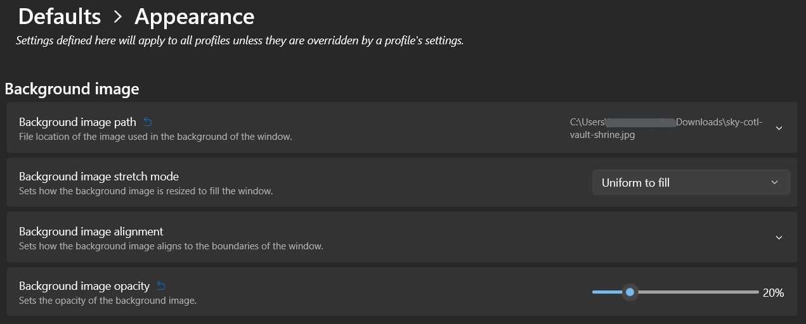
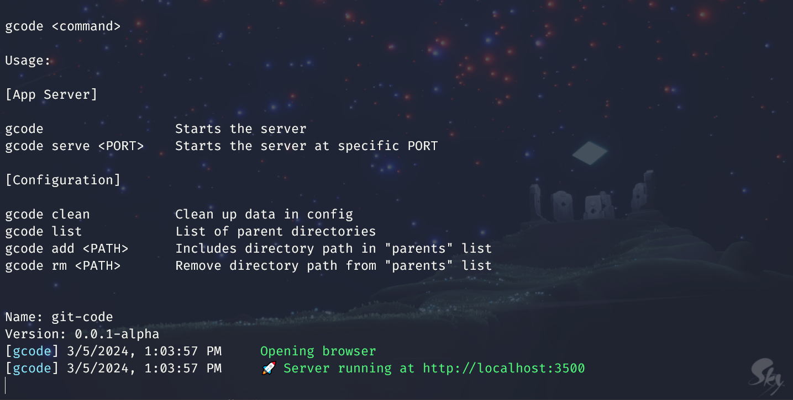

# Windows Terminal

The Windows Terminal is a modern, fast, efficient, powerful, and productive terminal application for users of command-line tools and shells like Command Prompt, PowerShell, and WSL. Its main features include multiple tabs, panes, Unicode and UTF-8 character support, a GPU accelerated text rendering engine, and custom themes, styles, and configurations.

This is an open source project and we welcome community participation. To participate please visit https://github.com/microsoft/terminal

## Download and Installation

Install via Microsoft Apps



You can also search in Google: `windows terminal` and see result from Microsoft Apps (https://apps.microsoft.com)

## Statup Settings

Start Windows Terminal and click on the down arrow symbol `˅` from menu bar.
Select `Settings` in the drop down menu.

And configure the following:

- **Default profile**
- **Default terminal application**
- **Launch Size**



Click `Save` at bottom right

## Setup Dracula Theme

Reference: https://draculatheme.com/windows-terminal

In bottom left, select the `Open JSON file`. This will open up a JSON settings.

In the `settings.json` settings file for Windows Terminal, find the `schemes` section
and paste the following content:

```json
"schemes": [
    {
        "name": "Dracula",
        "cursorColor": "#F8F8F2",
        "selectionBackground": "#44475A",
        "background": "#282A36",
        "foreground": "#F8F8F2",
        "black": "#21222C",
        "blue": "#BD93F9",
        "cyan": "#8BE9FD",
        "green": "#50FA7B",
        "purple": "#FF79C6",
        "red": "#FF5555",
        "white": "#F8F8F2",
        "yellow": "#F1FA8C",
        "brightBlack": "#6272A4",
        "brightBlue": "#D6ACFF",
        "brightCyan": "#A4FFFF",
        "brightGreen": "#69FF94",
        "brightPurple": "#FF92DF",
        "brightRed": "#FF6E6E",
        "brightWhite": "#FFFFFF",
        "brightYellow": "#FFFFA5"
    }
]
```

Click `Save` at bottom right

## Activate Theme



## Setup Background



## Result


